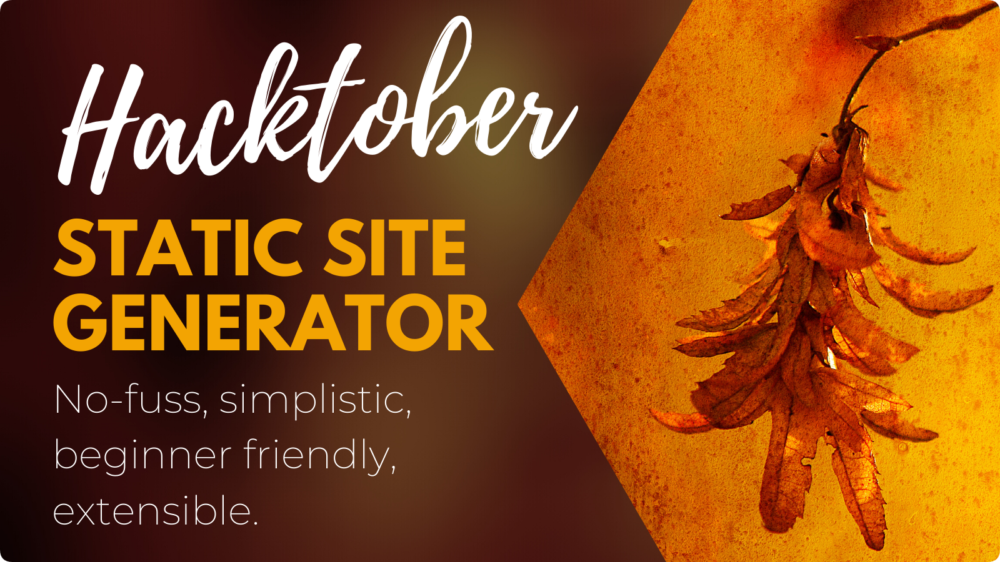

[](https://circleci.com/gh/DevGuideDaily/no-fuss)
[](https://coveralls.io/github/DevGuideDaily/no-fuss?branch=main)

[](./LICENSE)


# No Fuss - Static Site Builder

*No Fuss* is a simple static website builder, aiming to provide you with only the features you need, without any bloat. This project is part of the *Hacktober 2020* effort to contribute to open-source. Everyone is welcome to join the project. [Read how it works here](./docs/README.md).

## Goals

- [x] Transform simple assets like `pug` templates or `less` files
- [x] Fast and light weight - currently the package weighs only **7.4kb**
- [x] Minimal core, pluggable architecture
- [x] Fingerprint assets
- [x] Live-reload development server
- [x] No complicated frameworks
- [x] 100% test code coverage
- [x] Great documentation

# Usage

```bash
# Yarn
yarn add -D no-fuss
yarn fuss [command] [options]

# NPM
npm i -D no-fuss
npx fuss [command] [options]
```

## Commands

- `watch` - Watch files and incrementally build
- `build` - Build files once
- `serve` - Run the development server with live reload. This is the default command.

## Options

| Option          | Meaning                                |
| --------------- | -------------------------------------- |
| `-s, --src-dir` | Source directory (default is `./src`)  |
| `-o, --out-dir` | Output directory (default is `./dist`) |
| `-p, --port`    | Port (only used with `serve`)          |

---

## License

MIT
