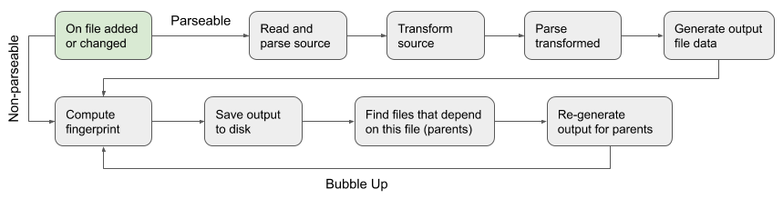

# How It Works

This part of the documentation aims to explain how this tiny project works.

## Basic Flow

Whenever a file is added or updated in the source directory, the following flow is triggered:

1. Read and parse the source file to determine the list of dependencies
1. Transform the source file, for example: `pug` to `html`
1. Parse the transform result to determine the list of dependencies
1. Generate the out file data
1. Compute the fingerprint of the file
1. Save the output file to disk with the fingerprinted file name
1. Save the mapping between the output file path and the source file path
1. Look for other already parsed files to see if they have the current file as dependency. If yes, regenerate those files, and for each of them check other files that might have them as dependency. This phase is called **bubble up**.



## Parsing

The parsing algorithm is very naive, but it gets the job done for the most common use cases. The way it works is:

1. It tries to find anything that looks like a file path using the following regex: `/([\/\.\w-_]+\.[a-z]+)/`
1. It resolves the path it finds based on the path of the current file, and the root path of the source folder.
	- If the found path is absolute, it is resolved as relative to the root path of the source folder.
	- If the found path is relative, it is resolved as relative to the directory of the current file.

At the end of the parsing process, the output is a structure called `ParsedFile`. Most notably, it has the field called `parts` which is an array of `strings` and `objects` like this:

```typescript
export interface ParsedFile {
	ext: string; // extension of the file
	parts: ParsedFilePart[];
}

export type ParsedFilePart = string | {
	originalPath: string; // path found using the regex
	absFilePath: string;  // resolved path as described above
}
```

## Generating Output File Data

The algorithm for generating the output file data takes the `ParsedFile` structure and generates a single string based on `parts`.

1. Start from an empty `string` and call it *result*.
1. If the current part is a `string`, simply append it to the result.
1. If the current part is an object, take the `absFilePath` and look to see if we have a mapping between that `absFilePath` (which is supposed to point to some file in our source directory) and some output file. If the mapping exists, use the path from the mapping. If the mapping doesn't exist, simply use the `originalPath`.

This basically means that we only fingerprint paths in the output file, for which we know for sure that they point to one of the source files we have. This allows the parsing algorithm to be very naive.

## Testing

An important goal of this project was to ensure *100% test coverage.* To achieve this, we had to test each interaction with the file system. We must know exactly what files are being read at what time and what files are being written and in what order.

To allow for this, an abstraction over the file system was created like so:

```ts
export interface FileSystem {
	readText: (path: string) => string;
	readBinary: (path: string) => Buffer;
	write: (path: string, data: FileData) => void;
	remove: (path: string) => void;
	watch: (dirPath: string, params: WatchCallbacks) => void;
	stop?: () => void;
}

export interface WatchCallbacks {
	onUpdate: (absPath: string) => void;
	onRemove: (absPath: string) => void;
}

interface FileSystemReadLogItem {
	read: string;
}

interface FileSystemWriteLogItem {
	write: string;
	data: FileData;
}

interface FileSystemRemoveLogItem {
	remove: string;
}

export type FileSystemLogItem =
	FileSystemReadLogItem |
	FileSystemWriteLogItem |
	FileSystemRemoveLogItem;
```

The main `pack` algorithm, which implements the above described processing takes an object which implements the `FileSystem` interface. This allows us to create 2 different implementations of the `FileSystem`

- One for testing
- One for actual use

The test file system stores all file data in memory and logs every operation such as *read*, *write*, *remove*... In the tests we setup the source files by writing to the test file system, and then let the `pack` algorithm run.

After the pack algorithm runs, we examine the log of the file system and check that all the operations are performed on the correct paths, in the correct sequence and with the correct data.

### Chokidar Mock

The file system implementation itself had to be tested as well, including the operations that touch the disc. Afterall, how can you ensure that this static site builder builds anything at all, unless you can verify that the files are being written to disk?

The basic read, write and remove operations were fairly easy to test, because the `fs` module exposes the `sync` methods which are perfrect for use in the tests. However, the *watch* functionality proved to be more complicated to test.

We use the `chokidar` package to watch the source folder, and it fires async events whenever a file is added, changed or removed. These events proved difficult to test reliably, because of the async nature. After trying a few different combinations of timeouts and clever tricks, the test just wouldn't reliably pass on circleci, even though they were passing locally.

The solution was implement a jest mock for this module. The implementation is quite trivial, but it allows our tests to run synchronously and fast, because we can trigger the *add*, *change* and *unlink* events manually:

```js
// __mocks__/chokidar.js

const chokidar = jest.createMockFromModule("chokidar");

const listeners = {};

chokidar.watch = () => {
	return {
		on: (event, callback) => listeners[event] = callback,
		unwatch: () => listeners = {},
		close: () => { }
	}
}

chokidar.trigger = (event, path) => {
	const listener = listeners[event];
	if (listener) listener(path);
}

module.exports = chokidar;
```

Here is a sample test using this mock:

```ts
it("calls onUpdate and onRemove callback correctly", () => {
	const fs = createFileSystem({ continuouslyWatch: true });
	const updatedPaths: string[] = [];
	const removedPaths: string[] = [];

	fs.watch(integrationTestsFolder, {
		onUpdate: path => updatedPaths.push(path),
		onRemove: path => removedPaths.push(path)
	});

	//@ts-ignore
	chokidar.trigger("add", "/added-file.txt");

	//@ts-ignore
	chokidar.trigger("change", "/changed-file.txt");

	//@ts-ignore
	chokidar.trigger("unlink", "/removed-file.txt");

	expect(updatedPaths).toEqual(["/added-file.txt", "/changed-file.txt"]);
	expect(removedPaths).toEqual(["/removed-file.txt"]);
});
```

We had to annotate with `@ts-ignore` because the types of the `chokidar` package do not support our custom `trigger` function.
